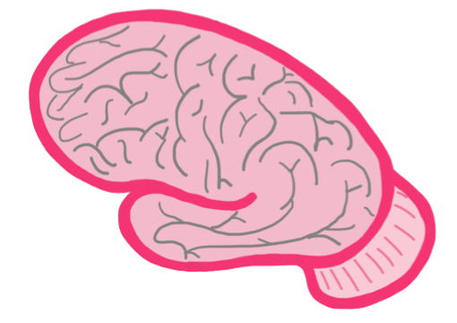
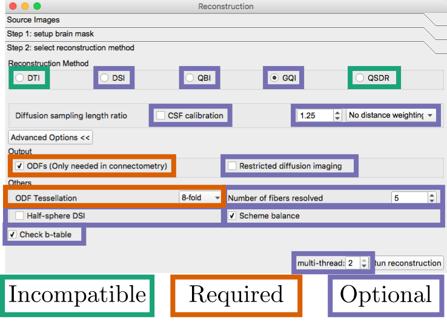
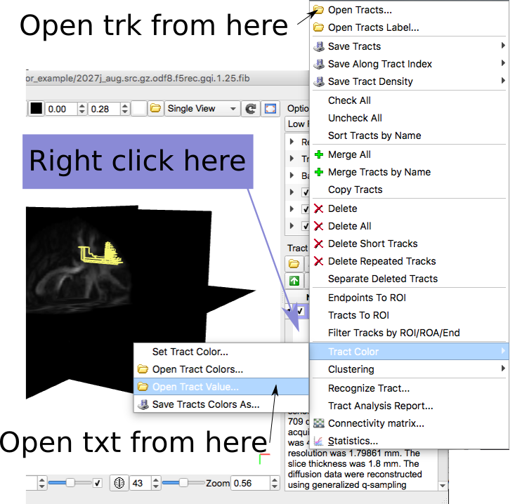
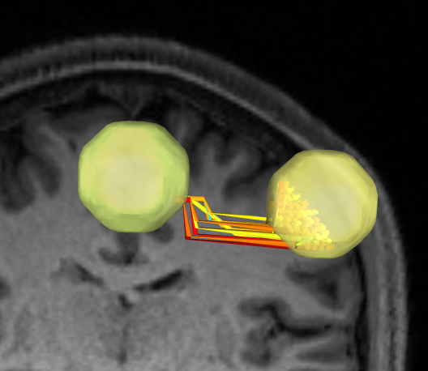

# MITTENS

MITTENS is a python library that performs analytical tractography
on reconstructed diffusion-weighted MRI data. Currently the output
from DSI Studio is supported.  


# Table of Contents
1. [Installation](#installation)
  * [Adding Geometric Constraints](#adding-geometric-constraints)
2. [Preparing your data](#preparing-your-data)
3. [Calculating intervoxel fiber transition probabilities](#calulating-intervoxel-fiber-transition-probabilities)
4. [`VoxelGraph` Construction](#voxel-graph-construction)
  * [Finding and visualizing connections between regions](#finding-and-visualizing-connections-between-regions)
  * [Building an `AtlasGraph`](#building-an-atlas-graph)


## Installation

MITTENS only works in Python 3 because of its dependency on ``networkit``.
It requires a fork of ``networkit`` that can be installed like so:

```bash
git clone https://github.com/tsbrennan1/networkit.git
cd networkit
pip install -e .
```

NOTE: On Mac OS you may need to specify the path to a recent c++
compiler. E.g. ``export CXX=/usr/local/bin/g++-7``.

While this software can be installed like any other python package,
it is possible to add custom compiled functions before installation.
Analytical tractography requires the specification of a set of geometric
constraints for inter-voxel tract transition expectations can be
solved. MITTENS comes with the functions used to perform the analyses
described in [our paper], but nothing more.

You can add as many sets of geometric constraints as you like, but be
warned that it can take awhile to compile them.  Remember you only
need to compile a solution __once__. Also beware that some
combinations of step size and turning angle maximum result in infinite
sets of turning angle sequences. Python will crash with a recursion error
in this case.

### Adding Geometric Constraints (optional)

Download the current version of MITTENS and enter its source tree:

```bash
$ git clone https://github.com/mattcieslak/MITTENS.git
$ cd MITTENS
```

Now, launch a python session in the mittens directory

```python
>>> from mittens.write_solution import write_solution
>>> write_solution("odf8", 35, 1.0)
```

This will write out two fortran files in the current directory. They are named
after the parameters you chose. This particular example will read data
reconstructed with 8-fold ODF tesselation, a turning angle maximum of 35
degrees and a step size of 1.0 voxel units (voxels are assumed to be
isotropic).

After some calculations you will find
``doubleODF_odf8_ss1_00_am35.f90`` and ``singleODF_odf8_ss1_00_am35.f90``
in the current directory. Move these files into the ``src/`` directory
and install the package with ``pip``. We recommend using an editable
install, which will keep all these files in their current directory:

```bash
mv *.f90 src/
pip install -e .
```

This will compile everything in the ``src/`` directory into a
python module. You can now use these geometric constraints to
calculate transition expectations.


## Preparing your data

DSI Studio can be used to reconstruct diffusion MRI using a variety
of methods.  You can use any method you like **except for DTI**.
If you acquired DTI data, choose **GQI** reconstruction instead of
DTI reconstruction.



DSI, GQI and QBI can be selected from this menu.  There are additional
options not listed on this GUI but are accessible through the commandline.
For example, ODF deconvolution and decomposition can be used. All
options in purple boxes can be changed, but it is required that ODF data
is written in the output file.  Critically, the ``ODF Tesselation``
option determines the angular resolution of your output ODFs. The choice
here will result in ``"odf8"`` being the appropriate choice for
the call to ``write_solutions()`` above.

Data from other diffusion MRI packages such as FSL and MRTRIX can be loaded
(theoretically) after being .

## Calculating intervoxel fiber transition probabilities

DSI Studio files are read directly by MITTENS:

```python
>>> from mittens import MITTENS
>>> mitns = MITTENS(input_fib="HCP.src.gz.odf8.f5rec.fy.gqi.1.25.fib.gz")
```

From here you can estimate none-ahead or one-ahead, where NIfTI-1 files are
saved for each neighbor direction:

```python
>>> mitns.calculate_transition_probabilities(output_prefix="hcp")
```

You will find the output in the current working directory (unless you specified an
absolute path as the argument). There is a single 3D file for each neighbor voxel
named ``hcp_doubleODF_r_prob.nii.gz``, ``hcp_singleODF_r_prob.nii.gz``,
``hcp_doubleODF_lpi_prob.nii.gz``, etc.  There will also be CoDI and CoAsy output.
Instead of re-running the estimations again, you can create a MITTENS object
by specifying the prefix of the NIfTI files written out during estimation.

```python
>>> nifti_mitns = MITTENS(nifti_prefix="hcp")
```

This is very fast.

## `VoxelGraph` Construction

MITTENS uses ``networkit`` to construct directed graphs of voxels, where edges
are weighted by the tract transition expectation from one voxel to another.
A graph can build directly from MITTENS object.

```python
>>> voxel_graph = mitns.build_graph(doubleODF=True, weighting_scheme="negative_log_p")
>>> voxel_graph.save("hcp_voxel_graph.mat")
```

There are different schemes available for weighting edges in the graph.

| Option                           | Transformation      | Reference |
| ---------------------------------|:-------------------:| ----------|
| `"negative_log_p"`               | negative log of transition probability | Zalesky (2008) |
| `"minus_iso_negative_log_p"`     | max(0, transition prob - isotropic transition prob) | None yet |
| `"minus_iso_scaled_negative_log_p"` | Same as above but scaled to sum to 1 across all neighbors of the voxel | None yet |
| `"transition_probability"` | The transition probability. Not useful for shortest paths | None yet |

You can also build a matching voxel graph using probabilities from isotropic ODFs

```python
>>> null_graph = mitns.build_null_graph(doubleODF=True, purpose="shortest paths")
>>> null_graph.save("hcp_null_voxel_graph.mat")
```
Both `voxel_graph` and `null_graph` will be of class `mittens.VoxelGraph`, which contains a `networkit.Graph` and spatial mapping information from the original dMRI data.  You can load these directly from disk using

```python
>>> from mittens import VoxelGraph
>>> loaded_voxel_graph = VoxelGraph("hcp_voxel_graph.mat")
>>> loaded_null_graph = VoxelGraph("hcp_null_voxel_graph.mat")
```

## Finding and visualizing connections between regions

Assuming the previous steps have been run, we can add an atlas to the graph
and query for connections between regions. Here we have two cortical regions we'd
like to connect. These regions are spheres around peak coordinates in primary
motor cortex (M1) and supplementary motor area (SMA). Here we find the shortest path
from each voxel in the M1 sphere to any voxel in the SMA sphere. The paths are
saved to be loaded into DSI Studio as streamlines, optionally with their corresponding
probabilities.

```python
>>> paths, probs = voxel_graph.region_voxels_to_region_query("lm1_sphere.nii.gz",
                      "sma_sphere.nii.gz", write_trk="test", write_prob="test")

```

This will write out two files. One is ``lm1_sphere.nii.gz_to_sma_sphere.nii.gz_test.trk.gz``
and the other is ``lm1_sphere.nii.gz_to_sma_sphere.nii.gz_test.txt``. To load in DSI Studio,
open the fib file used earlier via the "Step 3: Fiber Tracking" button.  Load the streamlines
through the context menu and color-code them based on their probabilities:



the color-coded streamlines are more informative:




## Building an `AtlasGraph`

Most network approaches to date use brain regions as nodes. You can add
brain regions to your `VoxelGraph` like so:

```python
voxel_graph.add_atlas("aligned_AAL.nii.gz")
```

This adds a region label to voxels contained within each region. The node
labels can be examined in the `VoxelGraph.atlas_labels`. No additional actions
(such as adding abstract "region nodes" or adding edges) are taken initially.
An `AtlasGraph`, a graph where nodes are brain regions and edges are based
on shortest paths through the `VoxelGraph` that connect them, can be
build like so:

```python
asym_raw_prob_graph, asym_mean_prob_graph, asym_path_length_graph, \
conj_raw_prob_graph, conj_mean_prob_graph = voxel_graph.build_atlas_graph()
```


Credits
========
This source code was sponsored by a grant from the GE/NFL head health challenge.
The content of the information does not necessarily reflect the position or
the policy of these companies, and no official endorsement should be inferred.

Authors
-------
 * Matt Cieslak
 * Tegan Brennan
 * Clint Greene

Logo by Allison Shapiro
